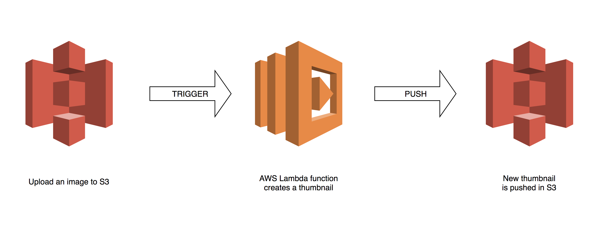
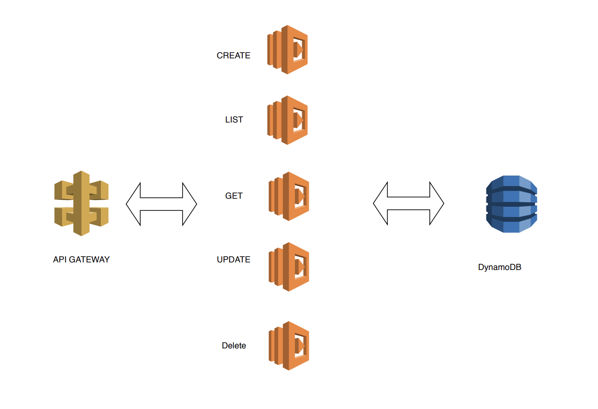
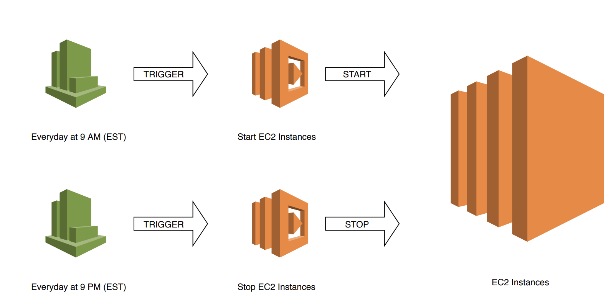

# Serverless-Repos

## Projects

1. [Serverless Thumbnail Generator](https://github.com/VivekBhat/serverless-thumbnail-aws): An app to create a thumbnail of the uploaded image

    ## Architecture
    

2. [Serverless REST API](https://github.com/VivekBhat/serverless-nodejs-dynamodb-rest-api): This example demonstrates how to setup a RESTful Web Services and perform the CRUD operations on a dynamoDB database

    ## Architecture
    

3. [Serverless EC2 Start Stop Automation](https://github.com/VivekBhat/serverless-ec2-start-stop): 
This example demonstrates how to automate the start and stop of your [AWS EC2](https://aws.amazon.com/ec2/) instances using  [AWS Lambda](https://aws.amazon.com/lambda/) and [AWS Cloudwatch](https://aws.amazon.com/cloudwatch/) with a cron job to do it.

    ## Architecture
        
    

### Credits: 
* [AWS Documentation](https://aws.amazon.com/documentation/)
* [AWS Lambda Documentation](https://docs.aws.amazon.com/lambda/latest/dg/welcome.html)
* [AWS Documentation on Github](https://github.com/awsdocs)
* [AWS Doc SDK Examples](https://github.com/awsdocs/aws-doc-sdk-examples)
* [AWS SDK for JavaScript examples](https://github.com/awsdocs/aws-doc-sdk-examples/tree/master/javascript)    
